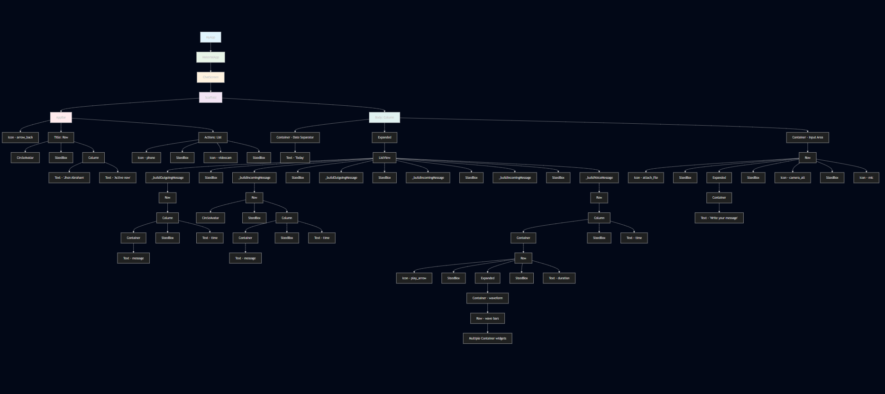

Flutter Chat UI
A chat interface built with Flutter, featuring a clean design with message bubbles, voice messages, and interactive input field.

 Features

Modern Chat Interface: Clean design matching popular messaging apps
Message Bubbles: Distinct styling for incoming and outgoing messages
Voice Messages: Interactive voice message bubbles with waveform visualization
User Avatar: Profile pictures for message identification
Responsive Design: Adapts to different screen sizes

🔧 Code Structure
Main Components
ChatScreen Widget

Message Builders

_buildOutgoingMessage(): Creates right-aligned message bubbles
_buildIncomingMessage(): Creates left-aligned message bubbles with avatars
_buildVoiceMessage(): Creates voice message bubbles with waveform

 UI Components Used

Scaffold: Main screen structure
AppBar: Top navigation bar
ListView: Scrollable message list
Container: Custom styling and spacing
CircleAvatar: User profile pictures
Icon: Various interface icons
Row/Column: Layout organization

Widget Tree

  

Assignment Submission
This Flutter chat UI demonstrates:

Understanding of Flutter widget hierarchy
Custom styling and theming
User interaction handling
Clean code organization

This project is created for educational purposes as part of a Flutter development assignment.

